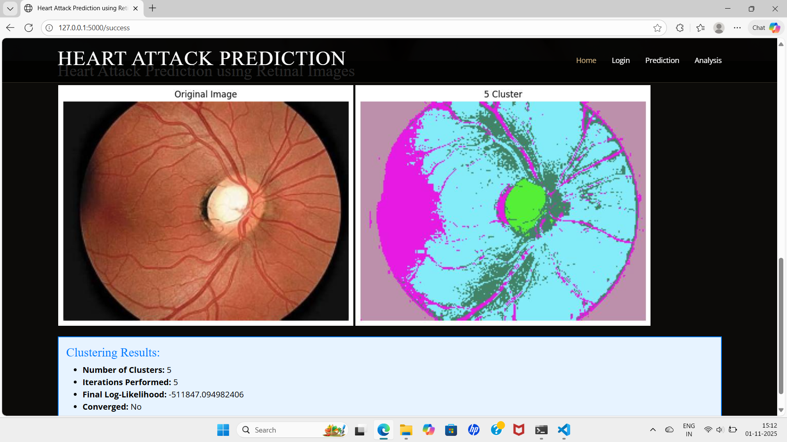

# ❤️ Cardioret: Cardiovascular Risk Prediction Using Retinal Eye Images

<div align="center">


### 🩺 AI-Powered Non-Invasive Heart Attack Risk Prediction Using Retinal Fundus Images

Predicting cardiovascular risk through retinal image analysis using **Fuzzy C-Means Clustering** and **Deep Learning (RNN)**.

</div>

---

# 📑 Table of Contents

- Project Overview
- Problem Statement
- Objectives
- Features
- System Architecture
- Workflow
- Technologies Used
- Dataset
- Project Structure
- Installation
- Usage
- Docker Deployment
- Results
- Screenshots
- Applications
- Future Scope
- Author
- License

---

# 📌 Project Overview

Cardiovascular diseases remain one of the leading causes of death worldwide. Early diagnosis significantly improves patient outcomes, but conventional diagnostic procedures are often expensive, invasive, and require specialized medical equipment.

This project presents an **Artificial Intelligence-based system** that predicts the risk of heart attack using **retinal fundus images**. Since retinal blood vessels reflect cardiovascular health, analyzing retinal images can provide valuable insights into a patient's heart condition without invasive procedures.

The system integrates **Image Processing**, **Machine Learning**, and **Deep Learning** techniques to automatically analyze retinal images and estimate heart attack risk.

---

# ❗ Problem Statement

Develop an intelligent healthcare system capable of predicting heart attack risk using retinal fundus images through advanced image processing and deep learning techniques, enabling early diagnosis with a non-invasive approach.

---

# 🎯 Objectives

- Develop an accurate AI-based heart attack prediction system.
- Analyze retinal blood vessel patterns.
- Improve early cardiovascular disease detection.
- Reduce dependency on invasive diagnostic procedures.
- Provide a user-friendly healthcare application.
- Assist doctors with intelligent decision support.

---

# ✨ Key Features

- 👁️ Retinal Image Analysis
- 🧠 Deep Learning-based Heart Attack Risk Prediction (RNN)
- 🎨 Fuzzy C-Means Clustering for Feature Extraction
- 📊 Risk Classification (Low, Medium, High)
- 💡 Personalized Health Tips Based on Predicted Risk Level
- 🥗 Lifestyle and Dietary Recommendations
- 📈 Feature Visualization and Analysis
- 🔐 Secure User Authentication
- 🌐 Interactive Web-based Interface
- ⚡ Fast and Accurate Prediction
- 🏥 AI-assisted Clinical Decision Support

---

# 🏗️ System Architecture

```text
                 ┌───────────────────────┐
                 │   Retinal Eye Image   │
                 └──────────┬────────────┘
                            │
                            ▼
               Image Preprocessing
                            │
                            ▼
             Fuzzy C-Means Clustering
                            │
                            ▼
              Feature Extraction Layer
                            │
                            ▼
              Recurrent Neural Network
                            │
                            ▼
             Heart Attack Risk Prediction
                            │
                            ▼
                 Result Visualization
```

---

# 🔄 Project Workflow

```text
Retinal Image
      │
      ▼
Image Upload
      │
      ▼
Image Preprocessing
      │
      ▼
Fuzzy C-Means Clustering
      │
      ▼
Feature Extraction
      │
      ▼
RNN Prediction Model
      │
      ▼
Heart Attack Risk Detection
      │
      ▼
Display Result
```

---

# 🛠️ Technologies Used

## Programming Language

- Python

## Machine Learning

- TensorFlow
- Keras
- Scikit-Learn
- Recurrent Neural Network (RNN)
- AdaBoost

## Image Processing

- OpenCV
- NumPy

## Data Analysis

- Pandas
- Matplotlib

## Web Development

- Flask
- HTML
- CSS
- JavaScript
- Bootstrap

## Database

- SQLite / MySQL

## Tools

- Git
- GitHub
- VS Code
- Jupyter Notebook

---

# 📂 Dataset

The project uses **Retinal Fundus Images** collected from publicly available retinal datasets and research resources.

### Dataset Contents

- Healthy Retina Images
- Diseased Retina Images
- Blood Vessel Structures
- Retinal Features

### Image Format

- JPG
- JPEG
- PNG

### Folder Structure

```
dataset/
│
├── Healthy/
├── Diseased/
├── Test/
└── Validation/
```

> **Note:** Ensure that all medical datasets are used only for research and educational purposes while maintaining patient privacy and ethical standards.

---

# 📁 Project Structure

```text
Heart-Attack-Risk-Prediction/
│
├── dataset/
├── static/
│   ├── css/
│   ├── js/
│   ├── images/
│   └── vendor/
│
├── templates/
│
├── app.py
├── label_image.py
├── image_fuzzy_clustering.py
├── requirements.txt
├── README.md
├── .gitignore
└── output_labels.txt
```

---

# ⚙️ Installation

## 1️⃣ Clone the Repository

```bash
git clone https://github.com/Megha11092018/CARDIORET-Cardiovascular-Risk-Prediction-using-retinal-images.git
cd Heart-Attack-Risk-Prediction
```

---

## 2️⃣ Create a Virtual Environment

### Windows

```bash
python -m venv venv
venv\Scripts\activate
```

### Linux / macOS

```bash
python3 -m venv venv
source venv/bin/activate
```

---

## 3️⃣ Install Dependencies

```bash
pip install -r requirements.txt
```

---

## 4️⃣ Verify Installation

```bash
python --version
pip list
```

---

# ▶️ Running the Application

Start the Flask application:

```bash
python app.py
```

Open your browser and visit:

```
http://127.0.0.1:5000
```

---

# 🚀 How to Use

1. Launch the web application.
2. Login using your credentials.
3. Upload a retinal fundus image.
4. The system preprocesses the image using Fuzzy C-Means clustering.
5. The trained RNN model predicts the heart attack risk level.
6. View the prediction result along with retinal feature analysis.
7. Receive personalized health tips, lifestyle recommendations, and preventive measures based on the predicted risk level.
8. Use the recommendations to support early awareness and healthier lifestyle choices.

---

# 📊 Model Pipeline

```text
Input Retinal Image
          │
          ▼
Image Preprocessing
          │
          ▼
Noise Removal
          │
          ▼
Fuzzy C-Means Clustering
          │
          ▼
Feature Extraction
          │
          ▼
Deep Learning (RNN)
          │
          ▼
Heart Attack Prediction
          │
          ▼
Result Visualization
```

---

# 📊 Results

The system predicts the heart attack risk level by analyzing retinal fundus images and provides meaningful health insights.

### Output Includes

- ✅ Clustered Retinal Image
- ✅ Predicted Risk Level (Low, Medium, High)
- ✅ Age Category
- ✅ Blood Pressure Information
- ✅ BMI Category
- ✅ Hemoglobin Range
- ✅ Personalized Health Tips
- ✅ Lifestyle Recommendations
- ✅ Preventive Healthcare Suggestions
- ✅ Graphical Visualization
---
# 💚 Personalized Health Recommendations

Based on the predicted heart attack risk level, the system provides customized health guidance to help users adopt healthier habits and reduce cardiovascular risk.

### 🟢 Low Risk
- Maintain a balanced diet.
- Exercise regularly.
- Stay hydrated.
- Schedule routine health check-ups.

### 🟡 Medium Risk
- Reduce salt and sugar intake.
- Increase physical activity.
- Monitor blood pressure regularly.
- Avoid smoking and excessive alcohol consumption.
- Consult a healthcare professional for regular evaluations.

### 🔴 High Risk
- Seek immediate medical consultation.
- Follow a heart-healthy diet.
- Take prescribed medications as directed.
- Monitor blood pressure and blood sugar frequently.
- Avoid stress and maintain regular follow-up with a cardiologist.

# 📷 Screenshots

## 🏠 Home Page

<p align="center">
  
</p>

---

## 🔐 Login Page

<p align="center">
  
</p>

---

## 📤 Image Upload

<p align="center">
  
</p>

---

## 🎨 Fuzzy C-Means Clustering

<p align="center">
  
</p>

---

## ❤️ Prediction Result

<p align="center">
  
</p>

---

## 💚 Health Tips Based on Risk Level

<p align="center">
  
</p>
---

# 🌍 Applications

- 🏥 Early Heart Disease Screening
- ❤️ Cardiovascular Risk Assessment
- 👨‍⚕️ Clinical Decision Support
- 📱 Telemedicine
- 🌐 Remote Healthcare
- 🩺 Preventive Healthcare
- 👴 Elderly Patient Monitoring
- 📊 Population Health Analysis

---

# 🚀 Future Scope

- Improve prediction accuracy using advanced Deep Learning models.
- Integrate Vision Transformers (ViT).
- Deploy the system on cloud platforms.
- Develop Android and iOS mobile applications.
- Support real-time retinal image analysis.
- Integrate Electronic Health Records (EHR).
- Enable continuous AI model updates using Federated Learning.

---

# 🤝 Contributing

Contributions are welcome!

1. Fork the repository.
2. Create a new feature branch.

```bash
git checkout -b feature-name
```

3. Commit your changes.

```bash
git commit -m "Added new feature"
```

4. Push your branch.

```bash
git push origin feature-name
```

5. Open a Pull Request.

---

# 📜 License

This project is developed for **educational and research purposes**.

You are free to use, modify, and improve this project with proper attribution.

---

# 👩‍💻 Author

**Megha B Biradar**

🎓 Computer Science & Engineering

💻 Aspiring DevOps Engineer | Java Full Stack Developer | AI & ML Enthusiast


---

# 🙏 Acknowledgements

Special thanks to:

- KLS Vishwanathrao Deshpande Institute of Technology
- Project Guide & Faculty Members
- Open Source Community


---

<div align="center">

## ⭐ If you found this project useful, please give it a Star ⭐

**Made with ❤️ by Megha B Biradar**

</div>
